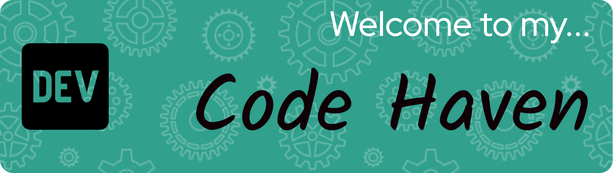

<h1 align="center">Hi 👋, I'm Ridwaan Omar</h1>
<h3 align="center">A passionate DevOps Engineer based in London</h3>

  

- 🌱 I’m currently learning **Automation, CI/CD & Kubernetes**

- 💬 Ask me about **Linux, AWS & Networking**

- 📫 How to reach me **ridwanomar101@gmail.com**

- ⚡ Fun fact **I love sports**

<h3 align="left">Connect with me:</h3>

<h3 align="left" style="color: #ffffff;">Languages and Tools:</h3>

  
  
  
  
  
  
  
  
  
  
  
  
  
  
  

